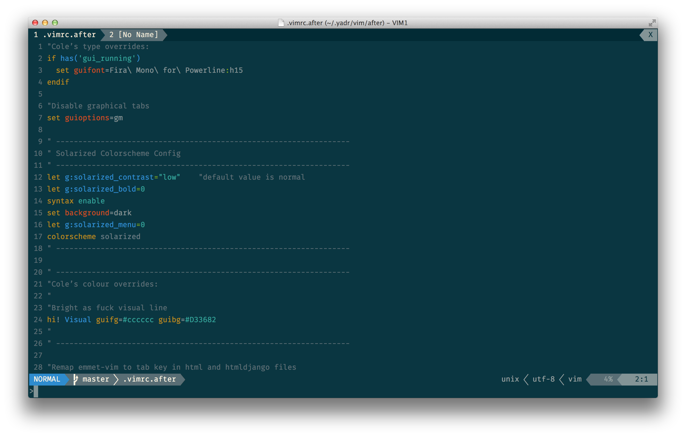

# Fira for Powerline

## About
This repository hosts a modified version of [Fira Mono](https://mozilla.github.io/Fira/), which has been modified for Powerline usage. Fira Mono works wonderfully as a coding typeface; these patched versions allow it to function properly when used with Powerline in Vim (see screenshot below for an example).

## License and other info
Please see the [master Fira repository on GitHub](https://github.com/mozilla/Fira) for license and further information.

## Screenshot

